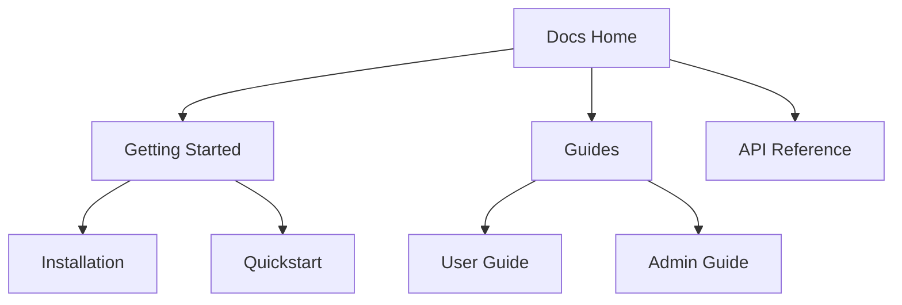

## Overview

Organize your Burdens documentation effectively to improve navigation and collaboration. Follow these best practices to create clear hierarchies, leverage tags for searchability, integrate version control, and streamline team workflows. A well-structured docs site saves time and reduces confusion for contributors and readers.

<Callout kind="tip">
  Start with a clear outline before writing. Map your topics into logical sections like "Getting Started", "Guides", and "API Reference".
</Callout>

## Creating Hierarchies and Sections

Build a logical structure using nested pages and sidebars in Burdens. Group related topics under parent sections for intuitive navigation.

<Steps>
  <Step title="Plan Your Structure" icon="map">
    Identify main categories such as onboarding, core features, and troubleshooting.
  </Step>
  <Step title="Create Folders" icon="folder">
    Use your docs repository to create folders like `guides/`, `api/`, and `reference/`.
  </Step>
  <Step title="Add Sidebar Config" icon="settings">
    Configure sidebar navigation in `sidebar.json` or MDX frontmatter to reflect your hierarchy.
  </Step>
  <Step title="Test Navigation" icon="search">
    Preview your site to ensure sections expand and collapse smoothly.
  </Step>
</Steps>



## Using Tags and Search

Tags enhance discoverability. Assign them to pages for filtered searches and dynamic categorization.

<Columns cols={2}>
  <Card title="Page Tags" icon="tag">
    Add `tags: ["feature", "guide"]` to frontmatter for categorization.
  </Card>
  <Card title="Search Optimization" icon="search">
    Use descriptive titles and keywords. Burdens search indexes content automatically.
  </Card>
</Columns>

| Tag Type     | Purpose                          | Example Tags              |
|--------------|----------------------------------|---------------------------|
| Category     | Group by topic                   | `guide`, `api`, `tutorial` |
| Status       | Track completeness               | `draft`, `published`      |
| Audience     | Target users                     | `beginner`, `advanced`    |

## Version Control for Docs

Treat documentation like code. Use Git for tracking changes and branching.

<CodeGroup tabs="Git CLI,GitHub Desktop">
  ```bash
  # Create a docs branch
  git checkout -b docs/v2.0

  # Commit changes
  git add docs/
  git commit -m "Update guides with new features"

  # Push and open PR
  git push origin docs/v2.0
  ```
  ```bash
  # In GitHub Desktop:
  # 1. Branch > New Branch > "docs/v2.0"
  # 2. Stage changes in docs folder
  # 3. Commit with message: "Update guides"
  # 4. Publish branch and create PR
  ```
</CodeGroup>

<Callout kind="alert">
  Always write clear commit messages. Prefix with "docs:" like `docs(guide): add authentication section`.
</Callout>

## Collaborative Editing Workflows

Streamline teamwork with pull requests and reviews.

<Tabs>
  <Tab title="Solo Developer" icon="user">
    Commit directly to `main` after local previews.
    
    <Expandable title="Advanced Solo Tips" default-open="false">
      Use pre-commit hooks to lint MDX files.
    </Expandable>
  </Tab>
  <Tab title="Team Collaboration" icon="users">
    <Steps>
      <Step title="Fork and Branch">
        Fork the repo, create a feature branch.
      </Step>
      <Step title="Draft PR">
        Open a draft pull request early for feedback.
      </Step>
      <Step title="Review and Merge">
        Address comments, then merge via squash.
      </Step>
    </Steps>
  </Tab>
</Tabs>

<ExpandableGroup>
  <Expandable title="Handling Conflicts">
    Resolve merge conflicts in tools like VS Code. Prioritize content accuracy over formatting.
  </Expandable>
  <Expandable title="Automation Tips">
    Set up CI/CD to build and deploy docs on merge. Use Burdens previews for PRs.
  </Expandable>
</ExpandableGroup>