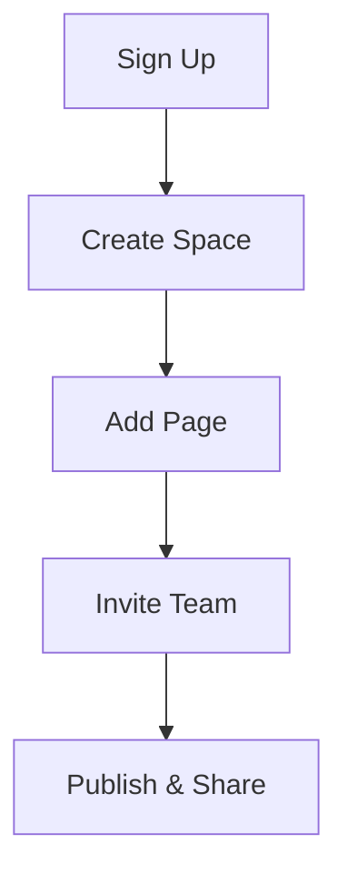

## Overview

Get started with Burdens Documentation in just a few minutes. Follow these steps to create your first documentation space, add pages, navigate the interface, edit content, and invite team members. You'll have a fully functional docs site ready for your project.

<Callout kind="tip">
  New to documentation platforms? Burdens handles hosting, versioning, and collaboration automatically. No server setup required.
</Callout>

## Create a New Documentation Space

Follow these steps to set up your space.

<Steps>
  <Step title="Sign Up" icon="user-plus">
    Visit `https://app.burdens.dev` and create an account using your email or GitHub.
  </Step>
  <Step title="Create Space" icon="plus">
    Click **New Space** in the dashboard. Enter a name like "My Project Docs" and select your brand color `#3B82F6`.
  </Step>
  <Step title="Configure Basics" icon="settings">
    Choose a subdomain (e.g., `myproject.burdens.dev`) and enable features like search and analytics.
  </Step>
</Steps>

## Add Your First Page

Once your space is ready, create content quickly.

<Steps>
  <Step title="New Page" icon="file-plus">
    In your space dashboard, select **New Page** and choose the root location (`/docs/index.mdx`).
  </Step>
  <Step title="Add Frontmatter" icon="code">
    Start with YAML frontmatter for metadata:
    
````mdx
```yaml
---
title: Welcome
description: Your project documentation home.
---
```
````
  </Step>
  <Step title="Publish" icon="upload">
    Preview changes, then click **Publish**. Your page goes live instantly.
  </Step>
</Steps>

## Basic Navigation and Editing

Burdens provides an intuitive editor with live previews.

<Tabs>
  <Tab title="Visual Editor" icon="edit-3">
    Use the WYSIWYG editor for drag-and-drop components. Insert `<Callout>`, images, or code blocks directly.
    
    <Image
      src="https://example.com/visual-editor-screenshot.png"
      alt="Visual editor interface showing component palette"
      width="800"
      height="500"
    />
  </Tab>
  <Tab title="Markdown Mode" icon="code">
    Switch to Markdown for advanced MDX. Supports JSX components like `<Steps>` and `<CodeGroup>`.
    
    Example snippet:
    
````mdx
```mdx
## Quick Tip

<Callout kind="info">This is a callout!</Callout>
```
````
  </Tab>
</Tabs>

## Invite Collaborators

Share your space with your team securely.

<Columns cols={2}>
  <Card title="Via Email" icon="mail" href="#">
    Send invites from the **Team** tab. Set roles: Admin, Editor, or Viewer.
  </Card>
  <Card title="GitHub Integration" icon="github" href="#">
    Connect your repo for pull request previews. Collaborators get instant access.
  </Card>
</Columns>

<CodeGroup tabs="API,CLI">
```javascript
// Invite via API
const response = await fetch('https://api.burdens.dev/v1/spaces/{spaceId}/invites', {
  method: 'POST',
  headers: { 'Authorization': 'Bearer YOUR_API_KEY' },
  body: JSON.stringify({ email: 'team@company.com', role: 'editor' })
});
```
```bash
# CLI invite
burdens spaces invite my-space-id team@company.com --role editor
```
</CodeGroup>

## Next Steps

<ExpandableGroup>
  <Expandable title="Customize Themes" default-open="true">
    Edit your space settings to match `#3B82F6`. Add custom CSS or logos.
  </Expandable>
  <Expandable title="Advanced Features">
    Explore analytics, custom domains, and webhooks for CI/CD integration.
  </Expandable>
</ExpandableGroup>



Your documentation is now live! Explore more in the navigation sidebar.